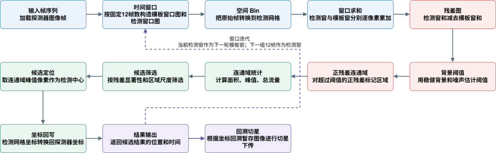

# ET-GRB-finder 当前交付算法说明

本文面向载荷实现方，说明当前 `scripts/grbfind.py`、`scripts/grbfind-bin2.py` 与 `scripts/grbfind-bin3.py` 的实际计算链路。说明只覆盖当前交付配置下会参与候选生成的步骤。

当前算法目标是对连续全帧图像做 12 帧求和差分搜索，在完整检测网格上直接完成 residual 背景估计、阈值分割、连通域识别和候选筛选，输出可下传或进一步处理的 GRB 候选位置和时间窗口。

## 在轨识别算法流程



图 3 在轨识别算法流程

## 当前入口

### 1x1 链路

```bash
conda run -n etbase python scripts/grbfind.py
```

### 2x2 空间 bin 链路

```bash
conda run -n etbase python scripts/grbfind-bin2.py
```

### 3x3 空间 bin 链路

```bash
conda run -n etbase python scripts/grbfind-bin3.py
```

三个入口共享同一套 `grbfinder/` 实现，区别只在脚本顶部的 `SCRIPT_DEFAULTS` 参数。

## 当前关键配置

| 配置项                              |       `grbfind.py` | `grbfind-bin2.py` | `grbfind-bin3.py` | 作用                             |
| ----------------------------------- | ------------------: | ----------------: | ----------------: | -------------------------------- |
| `spatial_bin`                     |              `1x1` |             `2x2` |             `3x3` | 检测网格空间 bin                 |
| `window_size`                     |               `12` |              `12` |              `12` | 每个检测窗口求和帧数             |
| `stride`                          |               `12` |              `12` |              `12` | 相邻窗口起点间隔                 |
| `max_windows`                     |             `None` |            `None` |            `None` | 不截断，使用输入 run 的全部窗口  |
| `template_strategy`               | `rolling-previous` | `rolling-previous` | `rolling-previous` | 当前窗口减最近完整前序窗口       |
| `use_tiles`                       |            `False` |           `False` |           `False` | 每个时间窗口一次处理完整检测网格 |
| `input_bit_depth`                 |               `16` |              `16` |              `16` | 输入整数帧范围检查               |
| `residual_threshold_sigma`        |              `3.0` |             `3.0` |             `3.0` | residual 像素阈值的 sigma 系数   |
| `residual_min_npix`               |               `50` |              `12` |               `6` | residual 连通域最小像素数        |
| `residual_max_npix`               |              `400` |             `400` |             `400` | residual 连通域最大像素数        |
| `min_residual_peak_value`         |            `50000` |          `250000` |          `250000` | residual 连通域最小峰值          |
| `min_residual_flux`               |                `0` |               `0` |         `1000000` | residual 连通域最小总通量        |
| `min_flux_peak_ratio`             |              `3.0` |             `2.0` |             `1.5` | 总通量与峰值的最小比值           |
| `previous_block_match_check`      |            `False` |          `False` |          `False` | 是否启用跨窗口候选关联           |
| `previous_match_radius_px`        |              `2.0` |             `2.0` |             `2.0` | 与上一检测窗口候选关联的半径     |
| `max_final_candidates_per_window` |             `5000` |            `5000` |            `5000` | 每个检测窗口最多输出候选数       |

默认输入 run：

```text
/home/cxgao/Results/GRB/grb_injected/main_rd_g17_120x10s_grb_seed20260529
```

输入帧路径格式：

```text
<input_run>/frames/frame_000000.npy
<input_run>/frames/frame_000001.npy
...
```

当前实际输入为：

```text
n_frames = 120
frame_shape = (9120, 8900)  # row, col
frame_dtype = uint16
```

## 坐标约定

代码内部使用 NumPy 图像坐标：

```text
row = y
col = x
```

输出候选使用探测器像素坐标：

```text
x = column coordinate
y = row coordinate
```

`grbfind.py` 的检测网格就是原始像素网格，因此：

```text
detector_x = bin_x
detector_y = bin_y
```

`grbfind-bin3.py` 的检测网格是 3x3 block 网格。若 residual 候选位于 bin 坐标 `(bin_x, bin_y)`，返回到原始 1x1 探测器坐标时取 3x3 block 中心：

```text
detector_x = 3 * bin_x + 1
detector_y = 3 * bin_y + 1
```

因此 3x3 链路输出坐标仍然落在原始探测器像素坐标系中，只是代表 3x3 block 的中心。

## 算法流水线顺序

当前默认入口 `scripts/grbfind.py`、`scripts/grbfind-bin2.py`、`scripts/grbfind-bin3.py` 的实际顺序是：

```text
原始单帧 F_i
  -> 单帧检测网格 B_i
     1x1: B_i = F_i
     2x2/3x3: B_i = 原始像素 block sum
  -> 当前窗口 12 帧和 C = sum(B_i in current window)
  -> 模板窗口 12 帧和 T = sum(B_i in template window)
  -> residual 差分 R = C - T
  -> residual 背景估计、阈值分割、连通域识别
  -> residual 连通域统计和初筛
  -> 坐标返回、可选跨窗口关联、final 输出
```

因此，对空间 bin 链路，代码实现上是**先把每一帧映射到检测网格，再对检测网格做 12 帧求和，最后做模板差分**。由于空间 block sum 和时间求和都是加法，数值上等价于“先做 12 帧原始求和，再做空间 bin”，但实现不是先保存一张原始全幅 12 帧和图再 bin。

## 1. 读取帧列表和基础检查

入口脚本调用 `grbfinder.cli.main()`，随后进入 `run_pipeline()`。流水线从输入 run 中读取：

```text
frames_dir = input_run / "frames"
frame_paths = sorted(frames_dir.glob("frame_*.npy"))
```

要求至少存在一个 `frame_*.npy`。第一帧必须是二维数组。当前输入为：

```text
shape = (9120, 8900)
dtype = uint16
```

位深检查只检查首帧和末帧的数值范围。对 `input_bit_depth = 16`，允许范围为：

```text
0 <= pixel_value <= 2^16 - 1 = 65535
```

## 2. 构造检测网格和空间 bin

检测网格尺寸由原始帧尺寸和空间 bin 决定：

```text
detection_rows = frame_rows // spatial_bin_rows
detection_cols = frame_cols // spatial_bin_cols
```

### 1x1 检测网格

`grbfind.py` 中：

```text
spatial_bin = 1x1
detection_shape = (9120, 8900)
cropped_input_shape = (9120, 8900)
```

不做空间合并，检测网格与原始帧一致。每一帧的检测网格图像直接来自原始帧：

```text
B_i[y, x] = F_i[y, x]
```

### 2x2 和 3x3 检测网格

`grbfind-bin2.py` 和 `grbfind-bin3.py` 中，每个检测网格像素是原始图像一个 block 的像素和。以 3x3 为例：

```text
B_i[y, x] = sum(F_i[3y + a, 3x + b] for a in 0..2 for b in 0..2)
```

等价展开为：

```text
B_i[y, x] =
    F_i[3y + 0, 3x + 0] + F_i[3y + 0, 3x + 1] + F_i[3y + 0, 3x + 2]
  + F_i[3y + 1, 3x + 0] + F_i[3y + 1, 3x + 1] + F_i[3y + 1, 3x + 2]
  + F_i[3y + 2, 3x + 0] + F_i[3y + 2, 3x + 1] + F_i[3y + 2, 3x + 2]
```

代码实现上，先读取参与检测网格的原始区域，然后 reshape 为：

```text
(out_h, spatial_bin_rows, out_w, spatial_bin_cols)
```

再沿两个 block 维度求和：

```text
sum(axis=(1, 3), dtype=uint32)
```

`grbfind-bin3.py` 中：

```text
spatial_bin = 3x3
detection_shape = (9120 // 3, 8900 // 3)
                = (3040, 2966)
cropped_input_shape = (3040 * 3, 2966 * 3)
                    = (9120, 8898)
```

由于 `8900` 不能被 `3` 整除，最右侧 2 列原始像素不进入 3x3 检测网格。

## 3. 构造时间窗口和 rolling 模板窗口

窗口使用半开区间：

```text
W_j = [j * stride, min(j * stride + window_size, n_frames))
```

当前配置：

```text
window_size = 12
stride = 12
n_frames = 120
```

因此窗口为：

```text
W_0 = [0, 12)
W_1 = [12, 24)
W_2 = [24, 36)
...
W_9 = [108, 120)
```

CSV 输出使用闭区间显示，所以 `W_1 = [12, 24)` 会写成：

```text
frame_start = 12
frame_end   = 23
```

当前模板策略为：

```text
template_strategy = rolling-previous
```

第一个窗口 `W_0` 只作为种子模板，不做检测。后续每个检测窗口减去最近的完整前序窗口：

```text
detect W_1 - template W_0
detect W_2 - template W_1
detect W_3 - template W_2
...
detect W_9 - template W_8
```

对 120 帧输入，当前链路实际处理：

```text
all_windows_including_template = 10
detection_windows_processed   = 9
```

## 4. 分别计算当前窗口和模板窗口的 12 帧和

当前交付配置 `use_tiles = False`，所以每个检测窗口一次处理完整检测网格。流水线不会在内存中保存完整 12 帧 cube，而是分别对当前窗口和模板窗口累加二维检测网格图像：

```text
C = current_sum  = sum(B_i for i in current_window)
T = template_sum = sum(B_i for i in template_window)
```

其中：

```text
B_i = 第 i 帧检测网格图像
C   = 当前窗口 12 帧和
T   = 模板窗口 12 帧和
```

求和数组类型为：

```text
SUM_DTYPE = uint32
```

当前配置下的最大理论和：

```text
1x1: 12 * 65535 = 786420
3x3: 12 * 9 * 65535 = 7077780
```

均远小于 `uint32` 上限。

## 5. 计算 residual 差分图

候选不从原始 12 帧和图中直接寻找，而是计算当前窗口相对模板窗口的残差。

差分前把两张求和图转为有符号整数：

```text
LOCAL_DIFF_DTYPE = int64
```

差分公式：

```text
R = int64(C) - int64(T)
```

其中：

```text
R = residual image
C = current_sum
T = template_sum
```

使用 `int64` 是因为模板相减后可能出现负残差。阈值和正残差 mask 在后续步骤中计算。

## 6. 全帧 robust 背景和 residual 阈值

对当前检测窗口的完整 residual 图 `R` 估计背景中位数和 robust sigma。

背景中位数：

```text
m = median(R)
```

绝对偏差：

```text
D = |R - m|
```

MAD：

```text
MAD = median(D)
```

robust sigma 使用整数近似：

```text
sigma = (MAD * 14826 + 5000) // 10000
```

这对应：

```text
sigma ≈ 1.4826 * MAD
```

若：

```text
sigma > 0
```

则 residual 阈值为：

```text
threshold = int(m + residual_threshold_sigma * sigma)
```

当前：

```text
residual_threshold_sigma = 3.0
```

若：

```text
sigma <= 0
```

则阈值退化为：

```text
threshold = max(int(m), 0)
```

## 7. 正残差 mask

只保留超过阈值的正残差像素：

```text
mask = (R > threshold) and (R > 0)
```

负残差和没有超过背景阈值的弱正残差不会进入后续连通域。

## 8. 8 邻域连通域

对 `mask` 做 8 邻域连通域标记：

```text
structure = ones((3, 3))
labels, nlabels = label(mask, structure=structure)
```

每个连通域表示一个 residual 候选区域。对每个连通域先做面积筛选：

```text
residual_min_npix <= npix <= residual_max_npix
```

当前阈值：

```text
grbfind.py:
  residual_min_npix = 50
  residual_max_npix = 400

grbfind-bin3.py:
  residual_min_npix = 6
  residual_max_npix = 400
```

`npix` 是检测网格上的连通域像素数。对 3x3 链路，一个检测网格像素对应原始图像的 9 个像素。

## 9. 连通域统计量

对通过面积筛选的连通域，取其 residual 像素集合：

```text
V = {R[y, x] | labels[y, x] == component_id}
```

像素数：

```text
residual_npix = len(V)
```

峰值：

```text
residual_peak_value = max(V)
```

总残差通量扣除 residual 背景：

```text
residual_flux = max(sum(V) - m * residual_npix, 0)
```

峰值比：

```text
flux_peak_ratio = residual_flux / max(residual_peak_value, 1)
```

候选中心初始取连通域内 residual 最大的像素。若有多个像素并列达到最大值，则：

1. 计算这些峰值像素的平均位置。
2. 选择距离该平均位置最近的峰值像素作为候选中心。

候选还会记录当前窗口求和图在峰值位置的值：

```text
source_peak_value = C[y_peak, x_peak]
```

## 10. residual 初筛

每个连通域候选必须通过以下条件：

```text
residual_peak_value >= min_residual_peak_value
residual_flux >= min_residual_flux
flux_peak_ratio >= min_flux_peak_ratio
```

当前 1x1 阈值：

```text
min_residual_peak_value = 50000
min_residual_flux = 0
min_flux_peak_ratio = 3.0
```

当前 3x3 阈值：

```text
min_residual_peak_value = 250000
min_residual_flux = 1000000
min_flux_peak_ratio = 1.5
```

这一步发生在完整 residual 图上，先于输出写表，是当前链路控制候选数量的主要步骤。

## 11. 候选坐标返回

通过 residual 初筛的候选会从检测网格坐标返回到原始探测器坐标。

通用公式：

```text
detector_x = bin_x * spatial_bin_cols + (spatial_bin_cols - 1) / 2
detector_y = bin_y * spatial_bin_rows + (spatial_bin_rows - 1) / 2
```

对 `grbfind.py`：

```text
spatial_bin_rows = 1
spatial_bin_cols = 1

detector_x = bin_x
detector_y = bin_y
```

对 `grbfind-bin3.py`：

```text
spatial_bin_rows = 3
spatial_bin_cols = 3

detector_x = 3 * bin_x + 1
detector_y = 3 * bin_y + 1
```

3x3 输出位置是对应 3x3 原始像素 block 的中心。

## 12. 跨窗口候选关联

跨窗口候选关联由显式开关控制：

```text
previous_block_match_check = False
```

当前三份入口脚本默认关闭该开关。关闭时，流水线不构建上一窗口候选 KD-tree，不做跨窗口匹配，也不会因为跨窗口匹配而改写 `pass_single_stack`。输出字段仍保持稳定：

```text
previous_block_match_check_enabled = 0
previous_block_match_flag = 0
track_length = 1
```

启用 `previous_block_match_check = True` 后，流水线只保留上一检测窗口的 final 候选元数据：

```text
x
y
frame_start
frame_end
track_length
```

当前窗口候选会用 KD-tree 查找上一窗口 final 候选中最近的点。若距离满足：

```text
distance <= previous_match_radius_px
```

当前：

```text
previous_match_radius_px = 2.0
```

则该候选标记为跨窗口匹配，并更新：

```text
previous_block_match_flag = 1
previous_block_match_dist_px = distance
track_length = previous_track_length + 1
candidate_priority = confirmed_previous_block
```

启用时，如果一个候选与上一检测窗口 final 候选匹配，代码会把该候选的 `pass_single_stack` 设为 `1`，因此它会影响 final 候选选择。当前默认关闭，所以跨窗口关联不参与 final 决策。

若没有跨窗口匹配：

```text
previous_block_match_flag = 0
track_length = 1
candidate_priority = single_block_psf_like
```

该状态缓存只保存元数据，不保存图像、cutout 或整帧数据。

## 13. final 候选输出

当前交付配置中，候选只要通过 residual 连通域检测和 residual 初筛，就进入 final 候选表。

若单个检测窗口的 final 候选数超过：

```text
max_final_candidates_per_window = 5000
```

则按以下键降序排序，并只保留前 5000 个：

```text
residual_flux
residual_peak_value
```

当前实际测试数据中候选数量远小于该上限。

## 输出文件

每次运行会在 `output_dir` 下写出：

```text
streaming_sum_candidates_after_measurement.csv
streaming_sum_transient_candidates.csv
streaming_sum_summary.csv
manifest.json
```

### `streaming_sum_candidates_after_measurement.csv`

记录 residual 初筛后、写 final 前的候选。当前配置下，它与 final 表的行数通常一致。

载荷实现方重点字段：

| 字段                             | 含义                                    |
| -------------------------------- | --------------------------------------- |
| `frame_start`                  | 检测窗口起始帧，闭区间                  |
| `frame_end`                    | 检测窗口结束帧，闭区间                  |
| `window_frame_count`           | 当前窗口帧数，通常为 12                 |
| `x`                            | 探测器坐标 x                            |
| `y`                            | 探测器坐标 y                            |
| `bin_x`                        | 检测网格 x                              |
| `bin_y`                        | 检测网格 y                              |
| `source_peak_value`            | 当前窗口求和图在候选峰值位置的值        |
| `residual_peak_value`          | residual 连通域峰值                     |
| `residual_flux`                | 扣除 residual 背景后的连通域总通量      |
| `residual_npix`                | residual 连通域像素数                   |
| `flux_peak_ratio`              | `residual_flux / residual_peak_value` |
| `previous_block_match_check_enabled` | 是否启用跨窗口关联开关             |
| `previous_block_match_flag`    | 是否与上一检测窗口候选关联              |
| `previous_block_match_dist_px` | 与上一检测窗口候选的距离                |
| `track_length`                 | 跨窗口连续关联长度                      |
| `candidate_priority`           | 当前候选优先级标记                      |
| `pass_single_stack`            | 是否进入 final 表                       |

### `streaming_sum_transient_candidates.csv`

记录最终输出候选。当前交付配置下，final 候选由 residual 前序链路决定。

### `streaming_sum_summary.csv`

每个检测窗口一行，记录该窗口候选数量：

| 字段                         | 含义                     |
| ---------------------------- | ------------------------ |
| `frame_start`              | 检测窗口起始帧           |
| `frame_end`                | 检测窗口结束帧           |
| `window_frame_count`       | 窗口帧数                 |
| `template_frame_start`     | 模板窗口起始帧           |
| `template_frame_end`       | 模板窗口结束帧           |
| `initial_sources`          | residual 连通域候选数    |
| `after_residual_prefilter` | residual 初筛后候选数    |
| `previous_block_matches`   | 与上一窗口关联的候选数   |
| `after_measurement`        | 写入 measured 表的候选数 |
| `final_candidates`         | 写入 final 表的候选数    |

### `manifest.json`

记录运行配置和总计数。实现方重点检查：

```text
input_shape
detection_shape
cropped_input_shape
spatial_bin_rows
spatial_bin_cols
template_strategy
window_size
stride
residual_threshold_sigma
residual_min_npix
residual_max_npix
min_residual_peak_value
min_residual_flux
min_flux_peak_ratio
previous_block_match_check
previous_match_radius_px
max_final_candidates_per_window
windows_processed
all_windows_including_template
candidates_after_measurement
final_candidates
```

## 当前 120 帧实测候选数

使用默认输入 run 和当前配置，全 120 帧结果如下：

| 链路                    | 检测窗口数 | measured candidates | final candidates |
| ----------------------- | ---------: | ------------------: | ---------------: |
| `grbfind.py` 1x1      |          9 |                  14 |               14 |
| `grbfind-bin2.py` 2x2 |          9 |                  14 |               14 |
| `grbfind-bin3.py` 3x3 |          9 |                  15 |               15 |

3x3 链路多出的 1 行来自同一事件在相邻检测窗口中重复出现；唯一候选事件数量与 1x1、2x2 链路一致。当前默认关闭跨窗口关联，因此该重复行不是由关联逻辑额外生成的。
